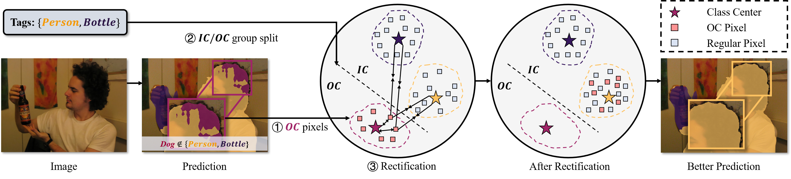

# Out-of-Candidate Rectification for Weakly-supervised Semantic Segmentation

The motivation of our paper, i.e., Out-of-Candidate Phenomenon of WSSS (Weakly-supervised Semantic Segmentation):

The proposed solver of ths Out-of-Candidate problems:

## Usage

Code is under preparation...
